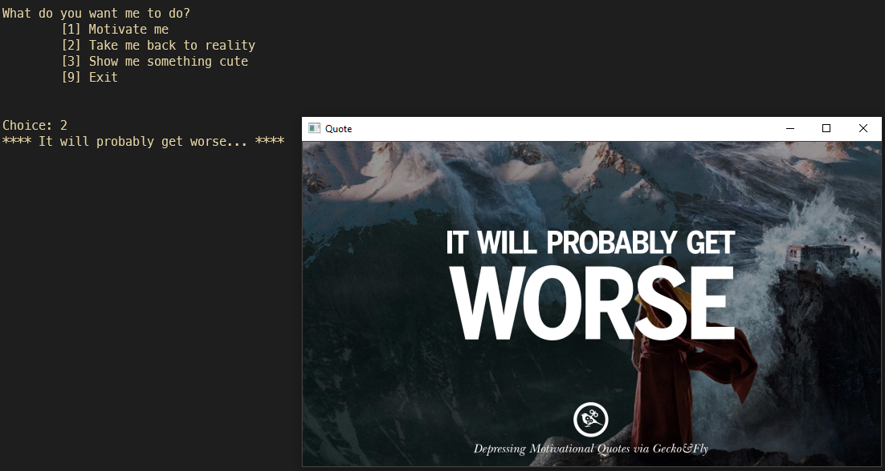

    

<h1 align="center">NVSV-01 - Mood changer</h1>
---

## About

A small python project that works with reading from a *json* file and uses a little bit of *oop* to either motivate or demotivate the user. - It can also display cute images.

## Scribble

<i>[Scribble]: A sketch of what the user interaction might look like</i>

## Features

* command line loop for choices
* motivate / demotivate / cute
* show text on cli as well as open image

---

~ Adrian (September 2021)